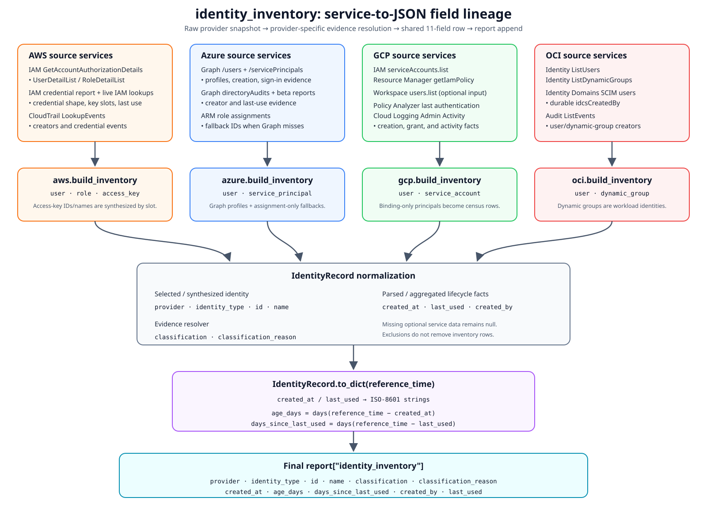

# `identity_inventory` field lineage

This document explains where every field in every `identity_inventory` row comes
from. It follows the live collectors, the offline builders, the shared serializer,
and the six reports under `op/*.json`.

The key architectural fact is that `identity_inventory` is a separate identity
census. It is rebuilt from the raw provider snapshot and appended to the policy
report; it is not copied from `users`, `roles`, or policy findings in the rendered
report. Finding exclusions therefore do not remove inventory rows.



## Output contract

Every row has exactly these 11 keys, in this order:

```json
{
  "provider": "aws | azure | gcp | oci",
  "identity_type": "provider-specific type",
  "id": "stable provider ID or documented fallback",
  "name": "human-readable principal name",
  "classification": "human | machine | unknown",
  "classification_reason": "the evidence selected by the classifier",
  "created_at": "ISO-8601 timestamp or null",
  "age_days": 123,
  "days_since_last_used": 7,
  "created_by": "creator principal or null",
  "last_used": "ISO-8601 timestamp or null"
}
```

The shared dispatch is in
[`identity_inventory/inventory.py`](../../cloudsplaining/identity_inventory/inventory.py),
the common row model is in
[`identity_inventory/model.py`](../../cloudsplaining/identity_inventory/model.py),
and tolerant timestamp/key parsing is in
[`identity_inventory/parsing.py`](../../cloudsplaining/identity_inventory/parsing.py).

## What each common field means

| Output field | How it is produced | Important behavior |
| --- | --- | --- |
| `provider` | Constant set by the selected provider builder: `aws`, `azure`, `gcp`, or `oci`. | It is not read from a cloud API response. The `oracle` CLI alias dispatches to the OCI builder, which still emits `oci`. |
| `identity_type` | Set by the branch that created the row. | AWS: `user`, `role`, `access_key`; Azure: `user`, `service_principal`; GCP: `user`, `service_account`; OCI: `user`, `dynamic_group`. Ordinary groups are membership containers and are deliberately not inventory identities. |
| `id` | Selected from the provider's stable ID fields, with a documented fallback. | AWS access-key IDs are synthetic slot IDs because an IAM credential report exposes key slots but not actual access-key IDs. GCP binding-only principals use their email as the ID. |
| `name` | Selected from the provider's display/name/email fields, with a documented fallback. | The field is intended for display and correlation; `id` should be preferred as the stable key when available. |
| `classification` | Provider builder resolves structural, name, credential, capability, or activity evidence. | Values are `human`, `machine`, or `unknown`. Classification describes likely identity use, not an authorization decision. |
| `classification_reason` | The exact reason attached to the winning classification signal. | This makes heuristic and soft-default decisions visible. The provider sections below give the decision order. |
| `created_at` | Provider creation timestamp, or the best available audit/grant proxy, parsed to UTC. | `null` means the snapshot did not contain usable evidence. GCP's first IAM grant is explicitly a proxy for when a user entered the project, not the person's directory creation time. |
| `age_days` | `max((reference_time - created_at).days, 0)`. | Derived locally during serialization; no cloud service supplies it. It is `null` exactly when `created_at` is `null`. Unless a caller supplies `reference_time`, the scan's current UTC time is used. |
| `days_since_last_used` | `max((reference_time - last_used).days, 0)`. | Derived locally during serialization; no cloud service supplies it. It is `null` exactly when `last_used` is `null`. |
| `created_by` | Provider audit/directory evidence, except AWS access-key rows, which structurally use their owning user. | Best-effort and retention-limited for audit-backed providers. A `null` value means unavailable/expired/unauthorized evidence, not necessarily that the identity was not created by another principal. |
| `last_used` | Most relevant provider activity/login timestamp, sometimes the maximum of several candidates. | Semantics differ by provider and identity type; the exact candidates are documented below. A never-used identity and an unavailable activity API can both yield `null`. |

Timestamp parsing accepts SDK `datetime` objects, dates, and ISO-8601 strings. A
trailing `Z` is normalized to UTC; naive timestamps are assumed UTC. Empty strings,
`null`, `none`, `n/a`, `no_information`, `not_supported`, and invalid timestamps
become `null`.

## AWS lineage

The core snapshot is produced by IAM
`GetAccountAuthorizationDetails` and contains `UserDetailList` and
`RoleDetailList`. Three best-effort enrichments add lifecycle/classification
evidence:

- IAM `GenerateCredentialReport` + `GetCredentialReport` supplies credential
  shape, access-key slots, and user/key use timestamps.
- IAM `ListAccessKeys`, `GetLoginProfile`, and `ListMFADevices` supply a live
  `credentialSupplement` only for users missing from the cached credential report.
- CloudTrail `LookupEvents`, filtered to `CreateUser`, `CreateRole`,
  `CreateServiceLinkedRole`, `CreateAccessKey`, and `CreateLoginProfile`, supplies
  creator attribution and fallback credential-shape evidence. CloudTrail event
  history is limited to roughly 90 days.

The collector calls are in
[`command/download.py`](../../cloudsplaining/command/download.py); row construction
is in [`identity_inventory/aws.py`](../../cloudsplaining/identity_inventory/aws.py).

| Output field | IAM user | IAM role | Access-key child row | Source/service and transformation |
| --- | --- | --- | --- | --- |
| `provider` | `aws` | `aws` | `aws` | Builder constant. |
| `identity_type` | `user` | `role` | `access_key` | Selected by `UserDetailList`, `RoleDetailList`, or an occupied credential-report key slot. |
| `id` | `Arn`, else `UserId`, else `UserName` | `Arn`, else `RoleId`, else `RoleName` | `(<owner Arn or name>)/access-key-<1|2>` | Core values come from IAM authorization details. Key IDs are synthesized because the credential report only labels slot 1/2. |
| `name` | `UserName` | `RoleName` | `<UserName>/access-key-<1|2>` | IAM authorization details plus a synthetic suffix for key rows. |
| `classification` | Evidence decision below | Service role → machine; SAML role → human; all other roles → machine | Always `machine` | User classification uses name, live IAM credential state, credential report, then CloudTrail. Role classification uses path/ARN and trust policy. |
| `classification_reason` | Winning user evidence string | `AWS service role`, `SAML-federated role`, or `workload role` | `access key` | Generated locally with the classification. |
| `created_at` | `CreateDate` | `CreateDate` | Credential report `access_key_<slot>_last_rotated` | IAM authorization details for users/roles; IAM credential report for keys. A slot exists if it has a rotation timestamp or is active. |
| `age_days` | Derived from `created_at` | Derived | Derived | Shared serializer; whole days, UTC, clamped at zero. |
| `days_since_last_used` | Derived from `last_used` | Derived | Derived | Shared serializer. |
| `created_by` | Creator from matching CloudTrail `CreateUser` | Creator from `CreateRole`, or response role name from `CreateServiceLinkedRole` | Owning user's ARN, else user name | CloudTrail creator preference is `userIdentity.arn`, then `userName`, then `principalId`. Key ownership is structural and does not depend on event retention. |
| `last_used` | Latest of IAM `PasswordLastUsed` and credential-report `password_last_used`, `access_key_1_last_used_date`, `access_key_2_last_used_date` | `RoleLastUsed.LastUsedDate` | Credential report `access_key_<slot>_last_used_date` | IAM authorization details and the IAM credential report. |

### AWS user classification order

The first available signal wins:

1. An automation token in `UserName` (for example a delimited `svc`, `bot`,
   `terraform`, or `runner`) produces `machine` and an
   `automation-style name (token: ...)` reason.
2. For a report-gap user, the live IAM supplement is used only when both
   `has_login_profile` and `access_keys_active` were obtained. Password or MFA
   means `human`; active keys with no password means `machine`; no credentials
   means `unknown`.
3. The credential report applies the same shape rules using `password_enabled`,
   `mfa_active`, and `access_key_<1|2>_active`.
4. A recent `CreateLoginProfile` CloudTrail event means `human`; a recent
   `CreateAccessKey` event means `machine`.
5. With no evidence, the result is `unknown`. The reason is
   `created after credential report was generated` when a report exists, otherwise
   `no credential evidence: credential report unavailable`.

The fifth label is inferred from a user being absent from an available cached
report. Although `credentialReportGeneratedTime` is stored in the snapshot, the
builder does not compare it with `CreateDate`.

Role order is structural: `/aws-service-role/` in the path/ARN wins first; then a
trust statement using `sts:AssumeRoleWithSAML` or a SAML provider makes the role
human; every other role is considered a workload role.

## Azure lineage

The Azure management-plane role APIs do not feed inventory rows. Inventory identity
and lifecycle data comes from Microsoft Graph:

- Graph v1.0 `/users` selects `id`, `userPrincipalName`, `displayName`,
  `createdDateTime`, and, when permitted/licensed, `signInActivity`.
- Graph v1.0 `/servicePrincipals` selects `id`, `appId`, `displayName`,
  `servicePrincipalType`, `accountEnabled`, and `createdDateTime`.
- Graph `/auditLogs/directoryAudits`, filtered to `Add user`,
  `Add service principal`, and `Invite external user`, supplies `created_by`.
- Graph beta `/reports/servicePrincipalSignInActivities` supplies service-principal
  `last_used` by `appId`.

The collector retries `/users` without `signInActivity` if the tenant lacks
`AuditLog.Read.All` and the required Entra licensing. Audit and report endpoints
also fail open to empty lists. See
[`multicloud/collectors/azure.py`](../../cloudsplaining/multicloud/collectors/azure.py)
and [`identity_inventory/azure.py`](../../cloudsplaining/identity_inventory/azure.py).

| Output field | Entra user | Service principal | Source/service and transformation |
| --- | --- | --- | --- |
| `provider` | `azure` | `azure` | Builder constant. |
| `identity_type` | `user` | `service_principal` | Chosen from the Graph `users` or `servicePrincipals` collection. |
| `id` | Graph `id`, else resolved name | Graph `id`, else resolved name | Microsoft Graph object ID is preferred. |
| `name` | `userPrincipalName`, else `displayName` | `displayName`, else `appId` | Microsoft Graph. |
| `classification` | Evidence decision below | Always `machine` | Service principals, including applications and managed identities, are workloads. |
| `classification_reason` | Winning user evidence string | `service principal` | Generated locally. |
| `created_at` | `createdDateTime` | `createdDateTime` | Microsoft Graph object property. |
| `age_days` | Derived from `created_at` | Derived | Shared serializer. |
| `days_since_last_used` | Derived from `last_used` | Derived | Shared serializer. |
| `created_by` | Initiator of a matching creation/invitation directory audit | Initiator of a matching creation audit | Audit initiator is the user's `userPrincipalName`, else the app's `displayName`. Target matching tries object `id`, UPN, and display name. Retention is commonly 30 days for P1/P2 and 7 days for free tenants. |
| `last_used` | Latest of `signInActivity.lastSignInDateTime`, `lastNonInteractiveSignInDateTime`, and `lastSuccessfulSignInDateTime` | Latest of object `signInActivity.lastSignInDateTime` and beta report `lastSignInActivity.lastSignInDateTime` (or row `lastSignInDateTime`) matched by `appId` | Microsoft Graph sign-in activity/report data. The live collector normally obtains SP use from the beta report because its SP `$select` does not include `signInActivity`. |

### Azure user classification order

The first available signal wins:

1. `sync_` at the start of the UPN, or display name exactly
   `on-premises directory synchronization service account`, means `machine`.
2. An automation-style UPN/display-name token means `machine`.
3. An interactive or successful interactive sign-in means `human`.
4. Non-interactive sign-ins with no interactive sign-in mean `machine`.
5. If sign-in data exists anywhere in the snapshot but this user has none, the
   user is `unknown` with reason `never signed in`.
6. If sign-in data is unavailable for the whole snapshot, the builder makes the
   explicit soft default `human` with reason
   `Entra user (sign-in data unavailable)`.

Groups are intentionally omitted. Also, principals synthesized by the Azure policy
engine from role assignments can appear in the report's `roles` section without an
inventory row when Graph did not return the corresponding service principal.

## GCP lineage

The live collector combines four GCP services:

- IAM v1 `projects.serviceAccounts.list` supplies service-account email and
  `uniqueId`.
- Cloud Resource Manager v1 `projects.getIamPolicy` supplies `user:` and
  `serviceAccount:` binding members; members missing from the directory/IAM list
  are still synthesized into inventory rows.
- Policy Analyzer
  `serviceAccountLastAuthenticationActivities.query` supplies
  `lastAuthenticatedTime` for service accounts.
- Cloud Logging v2 `entries.list` over Admin Activity supplies
  `CreateServiceAccount`, `SetIamPolicy`, and general principal activity.

The builder also accepts an optional `users` collection from Workspace / Cloud
Identity Admin SDK `users.list` with `primaryEmail`, `id`, `creationTime`, and
`lastLoginTime`. The current live GCP collector does not fetch that collection, so
it must be present in an offline/pre-enriched snapshot to be used.

See [`multicloud/collectors/gcp.py`](../../cloudsplaining/multicloud/collectors/gcp.py)
and [`identity_inventory/gcp.py`](../../cloudsplaining/identity_inventory/gcp.py).

| Output field | Service account | Workspace/directory user | Binding-only `user:` member | Source/service and transformation |
| --- | --- | --- | --- | --- |
| `provider` | `gcp` | `gcp` | `gcp` | Builder constant. |
| `identity_type` | `service_account` | `user` | `user` | IAM list/binding member or optional directory collection. Binding-only `serviceAccount:` members also become `service_account` rows. |
| `id` | `uniqueId`, else email | Directory `id`, else email | Email | IAM or Workspace/Cloud Identity; binding-only fallback comes from Resource Manager member text. |
| `name` | Service-account email | `primaryEmail` | Text after the `user:` prefix | IAM, directory, or IAM policy binding. |
| `classification` | Always `machine` | Name heuristic, else `human` | Name heuristic, else `human` | A binding member with a `gserviceaccount.com` domain is also recognized as a workload through the service-account branch/domain rule. |
| `classification_reason` | `service account` | Automation/workload-domain reason, else `Workspace directory user` | Automation/workload-domain reason, else `user: IAM binding member` | Generated locally. |
| `created_at` | Service-account `createTime`, else timestamp of a matching `CreateServiceAccount` audit event | Directory `creationTime`, else earliest retained `SetIamPolicy` ADD grant | Earliest retained `SetIamPolicy` ADD grant | IAM/directory is authoritative when present; audit logs are fallbacks/proxies. The current live collector stores only email/ID/display name from service-account list, so its `created_at` usually depends on audit logs. |
| `age_days` | Derived from `created_at` | Derived | Derived | Shared serializer. |
| `days_since_last_used` | Derived from `last_used` | Derived | Derived | Shared serializer. |
| `created_by` | `protoPayload.authenticationInfo.principalEmail` from matching `CreateServiceAccount` | Actor on earliest retained `SetIamPolicy` ADD grant | Same grant actor | Cloud Logging Admin Activity. The directory user's actual creator is not supplied by this builder. |
| `last_used` | Policy Analyzer `activity.lastAuthenticatedTime`, keyed by service-account email | Latest of Workspace `lastLoginTime` and newest Admin Activity entry whose `authenticationInfo.principalEmail` is the user | Newest matching Admin Activity timestamp | Workspace's Unix-epoch “never logged in” sentinel becomes `null`. User `last_used` means latest observed activity in this GCP project, not necessarily a console login. |

For grant attribution, only `SetIamPolicy` entries whose
`serviceData.policyDelta.bindingDeltas` contain `action = ADD` and a `user:` member
are considered. The earliest retained matching grant wins. The collector bounds
logging work: three newest general-activity pages, five service-account-creation
pages, and 15 oldest plus 15 newest grant pages (up to 1,000 entries per page).
Consequently, `null` can also mean the relevant event fell outside a page budget or
the roughly 400-day Admin Activity retention window.

## OCI lineage

The live collector combines:

- OCI Identity `ListUsers` for classic IAM user fields, including lifecycle and
  capability state already returned by that call.
- OCI Identity `ListDynamicGroups` for workload identities.
- OCI Identity Domains SCIM `ListUsers`, selecting `userName`, `ocid`, and
  `idcsCreatedBy`, to merge durable creator attribution onto classic user rows.
- OCI Audit `ListEvents`, in short windows around resource creation times, for
  `CreateUser` and `CreateDynamicGroup` creator attribution.

The builder also accepts full Identity Domains SCIM user objects in offline input,
including `meta.created`, the user-state extension, and the capabilities extension.
See [`multicloud/collectors/oci.py`](../../cloudsplaining/multicloud/collectors/oci.py)
and [`identity_inventory/oci.py`](../../cloudsplaining/identity_inventory/oci.py).

| Output field | OCI user | Dynamic group | Source/service and transformation |
| --- | --- | --- | --- |
| `provider` | `oci` | `oci` | Builder constant. |
| `identity_type` | `user` | `dynamic_group` | Selected from `users` or `dynamicGroups`. Ordinary groups remain membership containers. |
| `id` | OCI/SCIM `id`, else name | OCI `id`, else name | OCI Identity / Identity Domains. |
| `name` | `name`, else SCIM `userName` | `name` | OCI Identity / Identity Domains. |
| `classification` | Evidence decision below | Always `machine` | Dynamic groups represent instance/resource workloads. |
| `classification_reason` | Winning user evidence string | `workload identity` | Generated locally. |
| `created_at` | Classic `timeCreated`, else SCIM `meta.created` | `timeCreated` | OCI Identity / Identity Domains. |
| `age_days` | Derived from `created_at` | Derived | Shared serializer. |
| `days_since_last_used` | Derived from `last_used` | Always `null` because `last_used` is absent | Shared serializer. |
| `created_by` | SCIM `idcsCreatedBy.display`, else `.value`, else matching audit actor | Matching audit actor | Identity Domains takes precedence because it does not expire with Audit retention. Audit maps event `data.resourceName` to `data.identity.principalName`. |
| `last_used` | First available classic `lastSuccessfulLoginTime` / `lastSuccessfulLoginDate`, else the Identity Domains user-state extension `lastSuccessfulLoginDate` | `null` | OCI Identity / Identity Domains. |

### OCI user classification order

The first available signal wins:

1. An automation-style name means `machine`.
2. `isMfaActivated = true` means `human`.
3. `canUseConsolePassword = false` with `canUseApiKeys = true` means `machine`.
4. A parseable last-login timestamp means `human`.
5. `canUseConsolePassword = true` means the explicit soft default `human` with
   reason `console-capable (default)`.
6. With no evidence, classification is `unknown` with reason
   `no capability or activity evidence`.

Audit collection uses a 364-day lookback, two-minute windows around known creation
times, a five-page per-window cap, and a 100-page global cap. Missing permissions or
expired/capped events leave audit-backed `created_by` values `null` without failing
the scan.

## Validation against `op/*.json`

The audit below reads metadata only; it does not reproduce identity values. All six
files contain exactly the same 11 keys listed in the output contract.

| File | Rows | Identity types | Classification | `created_at: null` | `last_used: null` | `created_by: null` |
| --- | ---: | --- | --- | ---: | ---: | ---: |
| `op/aws-1.json` | 849 | 81 users, 674 roles, 94 access keys | 29 human, 820 machine | 0 | 223 | 652 |
| `op/azure-1.json` | 15,602 | 14,294 users, 1,308 service principals | 14,197 human, 1,405 machine | 0 | 15,602 | 15,602 |
| `op/azure-2.json` | 15,587 | 14,279 users, 1,308 service principals | 14,182 human, 1,405 machine | 0 | 15,587 | 15,587 |
| `op/gcp-1.json` | 147 | 41 users, 106 service accounts | 41 human, 106 machine | 132 | 89 | 132 |
| `op/oci-1.json` | 24 | 23 users, 1 dynamic group | 23 human, 1 machine | 0 | 5 | 0 |
| `op/oci-2.json` | 8 | 7 users, 1 dynamic group | 2 human, 6 machine | 0 | 8 | 1 |

These counts are consistent with the source logic:

- AWS has complete creation timestamps from IAM core data, while most creator
  events are older than CloudTrail's event-history window or unavailable. Its 94
  access-key rows are credential-report-derived child identities.
- Both Azure reports have Graph `createdDateTime` but no sign-in-report or directory
  audit enrichment. Thus every `last_used` and `created_by` is `null`; users are
  still classified through names and the documented Entra soft default, while all
  service principals are machines.
- GCP has many binding/IAM-list identities but only partial audit/directory
  enrichment, producing 132 missing creation/creator values. This is expected from
  the optional and page/retention-bounded lifecycle sources.
- OCI creation fields come from the core Identity call. Dynamic groups inherently
  have no `last_used`; user nulls mean no login timestamp was returned. OCI-2's one
  missing creator is compatible with Identity Domains/Audit enrichment being absent
  for that identity.

## Report insertion points

- AWS appends the census after policy analysis in
  [`command/scan.py`](../../cloudsplaining/command/scan.py).
- Azure, GCP, and OCI append it after provider report rendering in
  [`command/scan_cloud.py`](../../cloudsplaining/command/scan_cloud.py).
- A bare OCI statement-list input has no identity snapshot, so `scan-cloud` cannot
  build `identity_inventory` for that input form.

Because the inventory is independently built from the raw snapshot, counts need not
match the report's `users` or `roles` sections. This is deliberate: policy sections
represent analyzable principal-policy relationships, while `identity_inventory`
represents every supported identity the snapshot can establish.
