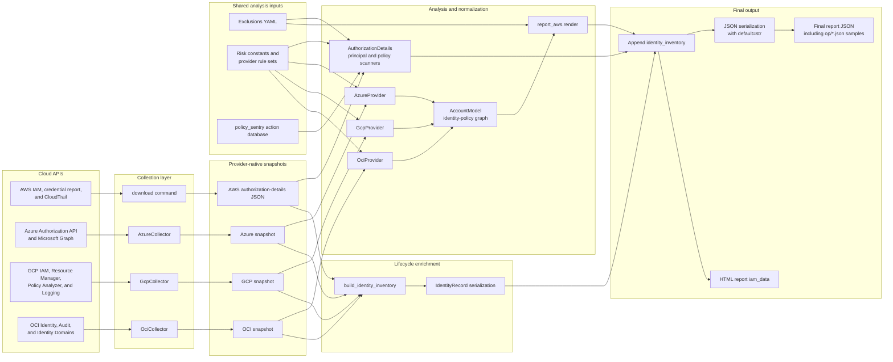
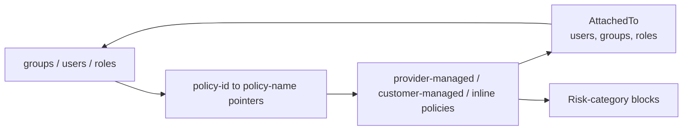

# JSON output architecture and field lineage

This document explains how Cloudsplaining builds the final JSON report, where
every report field comes from, and why it exists. It covers both report paths:

- AWS: `download` -> `scan`
- Azure, GCP, and OCI: `collect-cloud` -> `scan-cloud`

The implementation was traced through the collectors, provider engines, AWS
scanner, shared report serializer, identity-inventory builders, and tests. The
six local `op/*.json` reports were also parsed and compared structurally. No
identity names, account identifiers, policy contents, or other report values are
reproduced here.

## Reading the field maps

Paths use these placeholders:

- `{principal_id}` is a dynamic map key such as an AWS principal ID, Azure
  object ID, GCP member string, or OCI OCID.
- `{policy_id}` is a dynamic map key such as an AWS policy ID, Azure role GUID,
  GCP role name, or OCI policy OCID.
- `{provider}_managed_policies` means `aws_managed_policies`,
  `azure_managed_policies`, `gcp_managed_policies`, or
  `oci_managed_policies`.

There are four kinds of field provenance:

| Kind | Meaning |
| --- | --- |
| Fetched | Returned by a cloud API and copied into a snapshot. |
| Pass-through | Copied from the snapshot into the report, sometimes with a renamed key. |
| Derived | Computed from other values, relationships, risk rules, or the current time. |
| Static | Supplied by Cloudsplaining constants or configuration rather than a cloud API. |

This distinction matters because the final report is not a raw cloud response.
It is an identity-policy graph plus derived findings and lifecycle enrichment.

## End-to-end architecture

The report's central relationship is bidirectional. Principals point to policy
IDs, while every policy records the principal names to which it is attached:

## Collection sources

### AWS

The `download` command builds one authorization-details snapshot.

| Cloud call | Snapshot fields | Reason |
| --- | --- | --- |
| IAM `GetAccountAuthorizationDetails`, paginated with `User`, `Group`, `Role`, `LocalManagedPolicy`, and `AWSManagedPolicy` filters | `UserDetailList`, `GroupDetailList`, `RoleDetailList`, `Policies` | Supplies principals, group membership, trust policies, inline policies, attached managed-policy references, managed-policy metadata, and policy versions. Only managed policies with `AttachmentCount > 0` are retained. |
| IAM `GenerateCredentialReport` and `GetCredentialReport` | `credentialReport`, `credentialReportGeneratedTime` | Supplies user credential shape, access-key records, and user/key last-used timestamps for `identity_inventory`. This is best effort. |
| IAM per-user `ListAccessKeys`, `GetLoginProfile`, and `ListMFADevices` | `credentialSupplement` | Fills the gap when a newly created user is missing from the cached credential report. This is best effort and capped at 50 users. |
| CloudTrail `LookupEvents` for identity and credential creation events | `cloudTrailEvents` | Supplies creator attribution and fallback credential evidence for `identity_inventory`. Event history is limited by CloudTrail retention and permissions. |

The `scan` command reads that snapshot; it does not call AWS APIs.

### Azure

`AzureCollector` creates the Azure snapshot.

| Cloud call | Snapshot fields | Reason |
| --- | --- | --- |
| `AuthorizationManagementClient.role_definitions.list(subscription_scope)` | `roleDefinitions[].id`, `roleName`, `roleType`, `assignableScopes`, `permissions[].actions`, `notActions`, `dataActions`, `notDataActions` | Supplies built-in/custom role definitions and the permissions analyzed as policies. |
| `role_assignments.list_for_subscription()` | `roleAssignments[].principalId`, `principalType`, `roleDefinitionId`, `scope` | Connects principals to role definitions. |
| Microsoft Graph `/users` | `users[]` | Supplies users and `id`, UPN, display name, enabled state, type, creation time, and optional sign-in activity. |
| Microsoft Graph `/groups` and `/groups/{id}/members` | `groups[]`, `groupMemberships` | Supplies groups and user-to-group relationships. |
| Microsoft Graph `/servicePrincipals` | `servicePrincipals[]` | Supplies workload identities represented as report roles. |
| Microsoft Graph directory audits | `directoryAudits[]` | Best-effort creator attribution for users and service principals. |
| Microsoft Graph beta service-principal sign-in report | `servicePrincipalSignInActivities[]` | Best-effort last-used data for service principals. |

Graph collection fails open. Role definitions and assignments can still produce a
report when directory or reporting permissions are unavailable.

### GCP

`GcpCollector` creates the GCP snapshot.

| Cloud call | Snapshot fields | Reason |
| --- | --- | --- |
| IAM `projects.serviceAccounts.list` | `serviceAccounts[].email`, `uniqueId`, `displayName` | Supplies service-account principals. |
| IAM `projects.roles.list(view=FULL)` | `customRoles[].name`, `title`, `stage`, `includedPermissions` | Supplies customer-managed roles and their complete permission lists. |
| Resource Manager `projects.getIamPolicy(requestedPolicyVersion=3)` | `bindings[].role`, `members`, `resource`, optional `condition` | Connects members to roles. |
| IAM `roles.get` for every referenced `roles/...` binding | `predefinedRoles[].name`, `title`, `includedPermissions` | Expands only the provider-managed roles actually used by the project. |
| Policy Analyzer `serviceAccountLastAuthentication` | `serviceAccountActivities[]` | Best-effort service-account last-used data. |
| Cloud Logging Admin Activity queries | `auditLogEntries[]` | Best-effort service-account creation/creator data, human activity, and earliest IAM-grant proxies for human creation/creator data. |

Lifecycle calls fail open and emit empty arrays when the API is disabled or the
caller lacks permission.

### OCI

`OciCollector` creates the OCI snapshot.

| Cloud call | Snapshot fields | Reason |
| --- | --- | --- |
| Identity `list_users` | `users[]` | Supplies user identity, creation, login, MFA, and capability fields. |
| Identity `list_groups` | `groups[]` | Supplies group principals. |
| Identity `list_dynamic_groups` | `dynamicGroups[]` | Supplies workload identities represented as report roles. |
| Identity `list_policies` for the tenancy and its immediate compartments | `policies[].id`, `name`, `compartmentId`, `statements` | Supplies customer policy statements. |
| Identity `list_user_group_memberships` | `groupMemberships` | Connects users to groups. |
| Audit `list_events` around identity creation times | `auditEvents[]` | Best-effort creator attribution for users and dynamic groups. |
| Identity Domains SCIM `list_users` | `users[].idcsCreatedBy` | Best-effort durable creator attribution for Identity Domains users. |

## Top-level report fields

| Path | Type | Providers | Provenance and reasoning |
| --- | --- | --- | --- |
| `account_id` | string | All | AWS derives it from the first non-provider principal ARN in `roles`, then `users`, then `groups`. Multi-cloud reports copy the collector's subscription ID, project ID, or tenancy OCID. It is empty for older/bare inputs without account scope. |
| `provider` | string | Azure, GCP, OCI | Static provider name from `AccountModel.provider`. The legacy AWS serializer intentionally does not emit this field. |
| `groups` | object | All | Dynamic principal map. AWS builds it from `GroupDetailList`; provider engines build it from their normalized `AccountModel.groups`. |
| `users` | object | All | Dynamic principal map. AWS builds it from `UserDetailList`; provider engines build it from enumerated or binding-inferred identities. |
| `roles` | object | All | Dynamic role/workload map. AWS uses IAM roles; Azure uses service principals/managed identities; GCP uses synthetic role-like principals for public or otherwise untyped members; OCI uses dynamic groups and synthesized policy subjects. |
| `aws_managed_policies` | object | AWS | Attached AWS-managed IAM policies, selected by ARN prefix. |
| `azure_managed_policies` | object | Azure | Azure role definitions whose `roleType` does not contain `custom`. |
| `gcp_managed_policies` | object | GCP | GCP predefined roles whose names start with `roles/`. |
| `oci_managed_policies` | object | OCI | Present for schema symmetry. It is empty because the OCI engine currently creates only customer policies. |
| `customer_managed_policies` | object | All | AWS customer-managed IAM policies, Azure custom roles, GCP custom roles, or OCI policies. |
| `inline_policies` | object | All | AWS inline user/group/role policies. It is currently empty for Azure, GCP, and OCI because those engines create no `INLINE` policies. |
| `exclusions` | object | All | Pass-through of the active exclusions configuration. AWS can load a custom YAML file; `scan-cloud` currently calls the serializer with the packaged defaults. |
| `links` | object | All | AWS maps risky action names to policy_sentry documentation URLs. Multi-cloud serializers currently emit an empty object. |
| `identity_inventory` | array | All snapshot-object scans | A separate full identity census appended after policy report serialization. It is absent when `scan-cloud` receives a bare OCI statement list because that input has no identity snapshot. |

